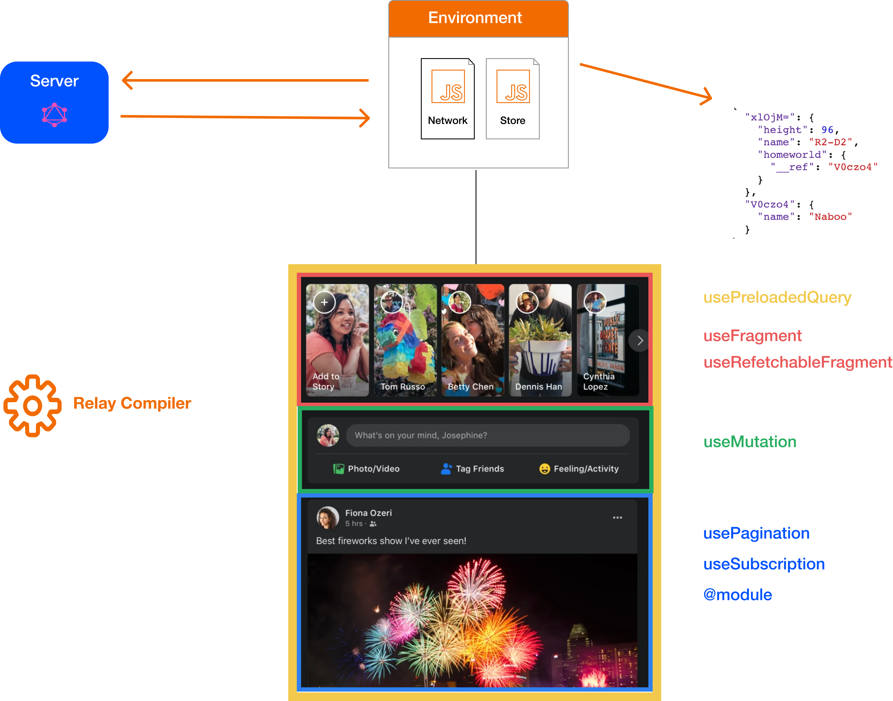
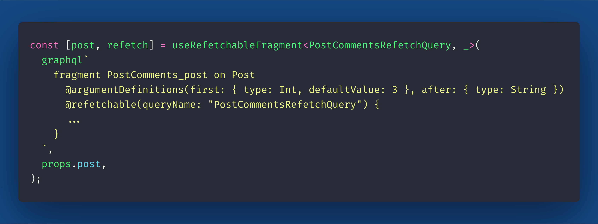

import { Head, Image, Appear } from "mdx-deck";
import { Split, FullScreenCode } from "mdx-deck/layouts";
import { CodeSurfer } from "mdx-deck-code-surfer";

import { Cover } from "./Cover";
import { Intro } from "./Intro";
import { Img } from "./Img";
import { InlineImg } from "./InlineImg";
import { Thanks } from "./Thanks";
import { Feedback } from "./Feedback";

export { default as theme } from "./theme";

<Head>
  <title>Relay Concepts</title>
</Head>

<Cover />

---

<Intro />

---

---

## Relay Compiler

---

## Relay Compiler

- compile your GraphQL fragments and operations
- better DX without compromising performance
- polyfill of arguments for GraphQL fragments

---

## Relay Artifacts - Types

---

## Relay Artifacts - AST

---

### Relay Artifacts - Full static Query/Mutation/Subscription

---

---

## Relay Environment

- Store + Network config
- Tell Relay how to store data
- Tell Relay how to fetch GraphQL operations

---

## Relay Environment

---

## Relay Store

- configures how to cache data
- configures garbage collector strategy

---

## Relay Store

---

## Relay Network Layer

- configures how Relay will fetch GraphQL operations
- configures how Relay will handle subscriptions

---

## Relay Network Layer - fetchQuery

- handle authentication on fetch Headers
- handle fetch with retries
- handle timeout
- handle unauthorized calls
- handle cache of queries (QueryResponseCache)
- can resolve many values (Observable)

---

## Simple fetchQuery example

---

## Simple subscription setup

---

---

## usePreloadQuery

- use data that has already started loading–e.g. due to an event occurring, such as changing location”
- render-as-you-fetch pattern

---

## usePreloadQuery

---

## Data Driven Components

---

## Data Driven Components

- each components declares the data they need
- declarative data fetching
- data fetching that scales

---

## useFragment

- declare component data requirements
- do not fetch data directly

---

## useFragment

---

---

## usePaginationFragment

- autogenerate pagination query
- can paginate forward and backward
- great DX

---

## usePaginationFragment

---

---

## useRefetchableFragment

- autogenerate refetch query
- let component execute a refetch query with different variables

---

## useRefetchableFragment

---

---

## useMutation

- prevent sending the same mutation twice
- optimistic updates
- cancel mutation when component unmounts

---

## useMutation

---

---

## useSubscription

- update relay store in realtime
- can notify users of new events

---

## useSubscription

---

---

## 3D - Data Driven Dependencies @match + @module

- GraphQL decide which components to preload

---

## Data Driven Dependencies

---

---

## Workshop

- You going to build a mini social network at the end of the workshop
- https://react-europe-relay-workshop.now.sh/

---

## References

- [GraphQL Docs](https://graphql.org/)
- [Relay Docs](https://relay.dev/)
- [Practical GraphQL for Relay](https://github.com/sibelius/practical-graphql-relay)
- [React Europe Relay Workshop Demo](https://react-europe-relay-workshop.now.sh/)

---

## References

- [Relay Docs about GraphQL Server Specification](https://relay.dev/docs/en/graphql-server-specification)
- [Object Identification](https://relay.dev/graphql/objectidentification.htm)
- [Cursor Connections](https://relay.dev/graphql/connections.htm)
- [Relay Mutations](https://relay.dev/graphql/mutations.htm)

---

## References

- [Relay Mutations Guide](https://relay.dev/docs/en/mutations)
- [Entria Playground](https://github.com/entria/entria-fullstack)
- [GraphQL Relay 2015](https://pt-br.reactjs.org/blog/2015/02/20/introducing-relay-and-graphql.html)
- [Building the New Facebook](https://developers.facebook.com/videos/2019/building-the-new-facebookcom-with-react-graphql-and-relay/)

---

## References

- [Introduction Relay and GraphQL](https://pt-br.reactjs.org/blog/2015/02/20/introducing-relay-and-graphql.html)
- [Relay Compiler Repl](https://relay-compiler-repl.netlify.com/)
- [Relay Modern Course](https://github.com/sibelius/relay-modern-course)
- [Concurrent Mode Suspense](https://reactjs.org/docs/concurrent-mode-suspense.html)
- [Facebook Redesign](https://engineering.fb.com/web/facebook-redesign/)

---

<Feedback />
